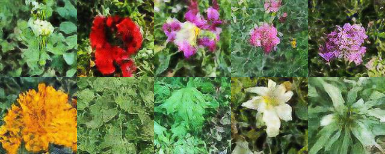

# PlantLDM

<p align="center">
  
</p>


We implemented a latent diffusion model (Rombach et al., [2021](https://arxiv.org/abs/2112.10752)) for 
the visual synthesis of plant images of the PlantNet-300K [dataset](https://github.com/plantnet/PlantNet-300K).
The model is can be split into two stages. The first stages consists of a VQ-GAN
(Esser et al., [2020](https://arxiv.org/abs/2012.09841)) which encodes the image into a latent representation.
A Denoising Diffusion Probabilistic Model (Ho et al., [2020](https://arxiv.org/abs/2006.11239)) forms the second stage, 
synthesizing the latent representations which are then decoded by the decoder of the first stage.

## Setup

Clone the repository and create a virtual environment (optional)

```
virtualenv venv
source venv/bin/activate
```

Then install the dependencies
```
pip install -r requirements.txt
```

## Usage

### Data

After downloading the [data](https://zenodo.org/record/4726653#.YvNwCFpBx3k) you can choose whether you want
to crop and resize the images on the fly or preprocess them in advance, which saves computational resources
during training. For the first option, just specify a config

```
data_dir: '<your_dir_to_data>'
is_preprocessed: False
```

and start the training with the `--data-config <your_cfg_file>` argument parser option. Additionally,
you need to specify the image size with the `--image-size <size>` option.

If you want to save resources and preprocess the data, just run the `make_data.py` script and create a config
with the respective data directory and the `is_preprocessed` option set to `True`. Then specify this config file
with the `--data-config <your_cfg_file>` argument parser option.

### Tensorboard

In order to monitor the losses and visualizations just `cd` into the repo and run
```
tensorboard --logdir=logs
```

### VQ-VAE

Implementation of VQ-VAE ([paper](https://arxiv.org/abs/1711.00937v2)).

#### Usage


```
python3 train_vqvae.py --name myExp --epochs 2 --config configs/vqvae.yaml
```

To first debug the code with `CIFAR10` just run

```
python3 train_vqvae.py --epochs 2 --config configs/vqvae.yaml --debug
```

### VQ-GAN

Implementation of VQ-GAN ([paper](https://arxiv.org/abs/2012.09841)).

#### Usage


```
python3 train_vqgan.py --name myExp --epochs 2 --config configs/vqgan.yaml
```

To first debug the code with `CIFAR10` just run

```
python3 train_vqgan.py --epochs 2 --config configs/vqgan.yaml --debug
```

#### Model Settings

You can specify the model settings in the `vqgan.yaml` config file. The length of the channels list in the config files also determines the down-scaling of the input image. For example, a list with two channels (eg [32, 64]) down-samples the image by a factor of 4.

```
model:
  autoencoder_cfg:
    in_channels: 3
    channels:
      - 32
      - 64
    dim_keys: 64
    n_heads: 4
  latent_dim: 32
  n_embeddings: 512
```

#### Losses

You can specify which losses to use and which weights for which loss in the `vqgan.yaml` config file.

```
loss:
  rec_loss_type: 'L1'
  perceptual_weight: 0.1
  codebook_weight: 0.9
  commitment_weight: 0.25
  disc_weight: 0.1
  disc_in_channels: 3
  disc_n_layers: 4
  disc_warm_up_iters: 5000
  disc_res_blocks: False
```
